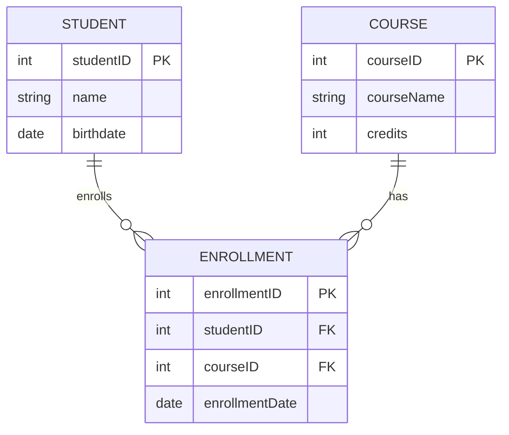

# 数据库概述
## 基本概念
- 数据：描述事物的符号记录
- 记录：计算机表示和存储数据的一种格式或方法。
- 数据库（DB）：长期存储在计算机中的有组织、可共享的大量数据的集合。
    - 数据库数据：永久存储、有组织和可共享
- 数据库管理系统（DBMS）：专门对数据进行管理和维护的**系统软件**。
    - 数据库的建立与维护：实用工具实现的
    - 数据定义功能：DDL（数据定义语言）实现的
    - 数据组织、存储和管理功能
    - 数据操作功能：DML（数据操作语言）实现的
    - 事务的管理和运行功能
    - 其他功能
- 数据库系统（DBS）：由数据库、数据库管理系统（及其相关的实用工具）、应用程序、数据库管理员（DBA）组成。
## 数据管理技术
### 文件管理
由开发人员定义存储数据的文件和文件结构，借助文件管理系统的功能编写访问这些文件的应用程序，以实现对用户数据的处理

缺点：
1. 编写应用程序不方便
2. 数据冗余不可避免，数据不一致
3. 应用程序依赖性，数据独立性很差
4. 不支持对文件的并发访问
5. 数据间联系弱，难以反映现实世界事物间客观存在的联系
6. 难以满足不同用户对数据的需求
7. 无安全控制功能
### 数据库管理
特点：
1. 相互关联的数据集合
2. 较少的数据冗余
3. 程序与数据相互独立
4. 保证数据的安全可靠
5. 最大限度保证数据的正确性（数据的完整性）
6. 数据库中的数据可以被共享，能保证数据一致性

数据库的特征：
- 相互关联的数据集合
- 综合方式组织数据
- 具有较小的数据冗余
- 可供多个用户共享
- 具有较高的数据独立性
- 具有安全控制机制，能保证数据的安全可靠
- 允许并发使用数据库，能有效、及时地处理数据
- 能保证数据的一致性和正确性

## 数据独立性
指应用程序不会因为数据的物理表示方式和访问技术的改变而改变，即应用程序不依赖于任何特定的物理表示方式和访问技术

- 物理独立性：当数据的存储位置或存储结构发生变化时，不影响应用程序的特性
- 逻辑独立性：当表达现实世界的信息内容发生变化时，也不影响应用程序的特性
# 数据库系统结构
## 数据和数据模型
### 数据与信息
- 数据：描述事物的符号记录
- 信息：从数据中获得的有意义的内容

- 静态特征：数据的基本结构、数据的约束条件
- 动态特征：定义在数据上的操作
### 数据模型
对现实世界数据特征的抽象
1. 概念层数据模型（概念模型）
2. 组织层数据模型：就是用什么样的数据结构来组织数据。
    - 层次模型（树状结构）
    - 网状模型（网状结构）
    - 关系模型（简单二维表）
    - 对象-关系模型
## 数据完整性
1. 实体完整性：所有表都有主键，且记录的主键值不相同、存在
2. 参照完整性
3. 语义完整性（域完整性）
## 三级模式结构
1. 内模式：底层物理结构
2. 外模式：模式的子集
3. 模式：表示数据库中的全部信息，用DDL定义模式
## 两级映像
- 外模式/模式映像：逻辑独立性
- 模式/内模式映像：物理独立性
# 数据定义功能
## 创建表
- NOT NULL
- DEFAULT
- UNIQUE
- CHECK
- PRIMARY KEY
- FOREIGN KEY
### 主键约束（Primary Key Constraint）

**列级（Column Level）语法：**
```sql
CREATE TABLE table_name (
    column_name data_type PRIMARY KEY,
    -- 其他列定义
);
```

**表级（Table Level）语法：**
```sql
CREATE TABLE table_name (
    column_name data_type,
    -- 其他列定义
    PRIMARY KEY (column_name)
);
```

### 外键约束（Foreign Key Constraint）

**列级（Column Level）语法：**
```sql
CREATE TABLE table_name (
    column_name data_type REFERENCES other_table (other_column),
    -- 其他列定义
);
```

**表级（Table Level）语法：**
```sql
CREATE TABLE table_name (
    column_name data_type,
    -- 其他列定义
    CONSTRAINT constraint_name FOREIGN KEY (column_name) REFERENCES other_table (other_column)
);
```
## 修改表结构
### 添加列（Add Column）
```sql
ALTER TABLE table_name
ADD column_name data_type;
```

### 删除列（Drop Column）
```sql
ALTER TABLE table_name
DROP COLUMN column_name;
```

### 修改列定义（Modify Column）
修改列定义可以包括改变列的数据类型、修改默认值等。不同的数据库系统对于修改列定义的支持会有所不同。

**修改数据类型：**
```sql
ALTER TABLE table_name
MODIFY COLUMN column_name new_data_type;
```

**修改列名称和数据类型（某些数据库系统如 PostgreSQL）：**
```sql
ALTER TABLE table_name
RENAME COLUMN old_column_name TO new_column_name;
```

### 添加约束（Add Constraint）
**添加主键约束：**
```sql
ALTER TABLE table_name
ADD CONSTRAINT constraint_name PRIMARY KEY (column_name);
```
```

**添加外键约束：**
```sql
ALTER TABLE table_name
ADD CONSTRAINT constraint_name FOREIGN KEY (column_name) REFERENCES other_table (other_column);
```

### 删除约束（Drop Constraint）
**删除主键约束：**
```sql
ALTER TABLE table_name
DROP PRIMARY KEY;
```

**删除外键约束：**
```sql
ALTER TABLE table_name
DROP CONSTRAINT constraint_name;
```
# 数据操作语句
## 查询
### 单表查询
#### 选择列
##### 选择指定列
```sql
SELECT Sno, Sname FROM Student
```
##### 选择全部列
```sql
SELECT * FROM Student
```
##### 计算列
```sql
SELECT Sname, 2015-Sage AS 年份 FROM Student
```
#### 选择元组
##### 去重
```sql
SELECT DISTINCT Sno FROM SC
```
##### 满足条件
| 查询条件       | 谓词                                                 | 示例                     |
|----------------|------------------------------------------------------|--------------------------|
| 等于           | `=`                                                  | `WHERE age = 30`         |
| 不等于         | `!=` 或 `<>`                                         | `WHERE age != 30`        |
| 比较运算符     | `>`, `<`, `>=`, `<=`                                 | `WHERE age > 30`         |
| 模糊匹配       | `LIKE` / `NOT LIKE`                                  | `WHERE name LIKE 'A%'`   |
| 范围查询       | `BETWEEN ... AND ...` / `NOT BETWEEN ... AND ...`    | `WHERE age BETWEEN 20 AND 30` |
| 集合包含       | `IN` / `NOT IN`                                      | `WHERE age IN (20, 30, 40)`   |
| 空值判断       | `IS NULL`                                            | `WHERE address IS NULL`       |
| 非空值判断     | `IS NOT NULL`                                        | `WHERE address IS NOT NULL`   |
| 子查询存在     | `EXISTS` / `NOT EXISTS`                              | `WHERE EXISTS (SELECT 1 FROM orders WHERE customer_id = customers.id)` |
| 逻辑谓词       | `AND`, `OR`, `NOT`                                   | `WHERE age > 30 AND city = 'New York'` |
###### 模糊查询
1. **百分号 (`%`)**：
   - **作用**：匹配零个或多个字符。
   - **示例**：
     - `LIKE 'A%'`：匹配以“A”开头的任意字符串，例如“Alice”、“Andrew”。
     - `LIKE '%test'`：匹配以“test”结尾的任意字符串，例如“unittest”、“mytest”。
     - `LIKE '%abc%'`：匹配包含“abc”的任意字符串，例如“123abc456”、“abc”。
   
2. **下划线 (`_`)**：
   - **作用**：匹配一个任意字符。
   - **示例**：
     - `LIKE 'A_'`：匹配以“A”开头的两个字符的字符串，例如“Am”、“Ax”。
     - `LIKE 't_st'`：匹配以“t”开头，中间任意一个字符，最后是“st”的字符串，例如“test”、“tost”。

3. **方括号 (`[]`)**： 
   - **作用**：匹配方括号内的任意一个字符。方括号内可以列出多个字符或使用字符范围。
   - **示例**：
     - `LIKE 't[aeiou]t'`：匹配以“t”开头，中间是元音字母，最后是“t”的字符串，例如“tat”、“tet”、“tit”。
     - `LIKE '[A-C]%'`：匹配以“A”、“B”或“C”开头的字符串，例如“Alice”、“Bob”、“Carol”。

4. **脱字符（`^` 或 `!`）**：
   - **作用**：在方括号内使用时，表示不匹配方括号内的字符。注意，不同的数据库使用符号可能有所不同（例如，SQL Server 使用 `!`，而其他数据库则使用 `^`）。
   - **示例**：
     - 在 SQL Server 中：`LIKE 't[!aeiou]t'`：匹配以“t”开头，中间不是元音字母，最后是“t”的字符串，例如“tbt”、“tpt”。
     - 在其他数据库中：`LIKE 't[^aeiou]t'`：同样匹配以“t”开头，中间不是元音字母，最后是“t”的字符串。

去除尾随空格：RTRIM
#### 排序
语法：
```sql
ORDER BY column_name [ASC/DESC]
```
- 升序：ASC
- 降序：DESC
#### 聚合函数
> 聚合函数不能出现在WHERE子句中

| 函数名称 | 作用 | 示例 |
| --- | --- | --- |
| `COUNT()` | 计算表中行的数量或列中非空值的数量 | `SELECT COUNT(*) FROM employees;` 计算员工表中的总行数（包括NULL） |
| `SUM()` | 对数值列求和 | `SELECT SUM(salary) FROM employees;` 计算员工表中所有员工的薪水总和 |
| `AVG()` | 计算数值列的平均值 | `SELECT AVG(salary) FROM employees;` 计算员工表中所有员工的平均薪水 |
| `MAX()` | 查找列中的最大值 | `SELECT MAX(salary) FROM employees;` 查找员工表中最高的薪水 |
| `MIN()` | 查找列中的最小值 | `SELECT MIN(salary) FROM employees;` 查找员工表中最低的薪水 |
#### 分组
##### 基本语法

```sql
SELECT column_name, AGGREGATE_FUNCTION(column_name)
FROM table_name
GROUP BY column_name;
```

##### 示例讲解

假设我们有一个名为`employees`的表，结构如下：

```sql
CREATE TABLE employees (
    id INT,
    name VARCHAR(100),
    department VARCHAR(50),
    salary DECIMAL(10, 2)
);
```

###### 示例1：按部门统计员工数量

```sql
SELECT department, COUNT(*) AS NumEmployees
FROM employees
GROUP BY department;
```

这段SQL代码将按照部门对员工进行分组，并计算每个部门的员工数量。输出结果可能如下：

| department | NumEmployees |
| --- | --- |
| HR | 5 |
| IT | 10 |
| Sales | 8 |

###### 示例2：按部门计算平均薪水

```sql
SELECT department, AVG(salary) AS AvgSalary
FROM employees
GROUP BY department;
```

这段SQL代码将按照部门对员工进行分组，并计算每个部门的平均薪水。输出结果可能如下：

| department | AvgSalary |
| --- | --- |
| HR | 50000.00 |
| IT | 75000.00 |
| Sales | 60000.00 |

###### 示例3：按部门计算最高和最低薪水

```sql
SELECT department, MAX(salary) AS MaxSalary, MIN(salary) AS MinSalary
FROM employees
GROUP BY department;
```

这段SQL代码将按照部门对员工进行分组，并计算每个部门的最高和最低薪水。输出结果可能如下：

| department | MaxSalary | MinSalary |
| --- | --- | --- |
| HR | 70000.00 | 40000.00 |
| IT | 100000.00 | 50000.00 |
| Sales | 85000.00 | 45000.00 |

##### 使用 HAVING 过滤分组结果

`HAVING` 子句用于过滤分组后的结果，它类似于 `WHERE` 子句，但 `WHERE` 是用来过滤行，而 `HAVING` 是用来过滤分组。

###### 示例4：筛选平均薪水大于60000的部门

```sql
SELECT department, AVG(salary) AS AvgSalary
FROM employees
GROUP BY department
HAVING AVG(salary) > 60000;
```

这段SQL代码将返回平均薪水大于60000的部门。输出结果可能如下：

| department | AvgSalary |
| --- | --- |
| IT | 75000.00 |
| Sales | 65000.00 |

##### 注意事项

1. **必须在`GROUP BY`子句中列出非聚合列**：在`SELECT`语句中出现的非聚合列必须在`GROUP BY`子句中列出。
2. **`HAVING`子句的位置**：`HAVING`子句应该放在`GROUP BY`子句之后，`ORDER BY`子句之前。

### 多表连接查询
#### 数据准备

假设我们有两个表 `employees` 和 `departments`，记录如下：

##### `employees` 表
| employee_id | name    | department_id |
|-------------|---------|---------------|
| 1           | Alice   | 1             |
| 2           | Bob     | 2             |
| 3           | Charlie | 2             |
| 4           | David   | NULL          |

##### `departments` 表
| department_id | department_name |
|---------------|-----------------|
| 1             | HR              |
| 2             | IT              |
| 3             | Finance         |

#### 内连接 (INNER JOIN)

**内连接**只返回两个表中匹配的记录。

##### SQL 示例
```sql
SELECT employees.name, departments.department_name
FROM employees
INNER JOIN departments
ON employees.department_id = departments.department_id;
```

##### 查询结果
| name    | department_name |
|---------|-----------------|
| Alice   | HR              |
| Bob     | IT              |
| Charlie | IT              |

#### 左连接 (LEFT OUTER JOIN)

**左连接**返回左表中的所有记录，以及右表中匹配的记录。如果右表中没有匹配记录，则结果中包含 `NULL`。

##### SQL 示例
```sql
SELECT employees.name, departments.department_name
FROM employees
LEFT OUTER JOIN departments
ON employees.department_id = departments.department_id;
```

##### 查询结果
| name    | department_name |
|---------|-----------------|
| Alice   | HR              |
| Bob     | IT              |
| Charlie | IT              |
| David   | NULL            |

#### 右连接 (RIGHT OUTER JOIN)

**右连接**返回右表中的所有记录，以及左表中匹配的记录。如果左表中没有匹配记录，则结果中包含 `NULL`。

##### SQL 示例
```sql
SELECT employees.name, departments.department_name
FROM employees
RIGHT OUTER JOIN departments
ON employees.department_id = departments.department_id;
```

##### 查询结果
| name    | department_name |
|---------|-----------------|
| Alice   | HR              |
| Bob     | IT              |
| Charlie | IT              |
| NULL    | Finance         |

#### 全连接 (FULL OUTER JOIN)

**全连接**返回两个表中的所有记录。如果没有匹配的记录，则结果中包含 `NULL`。

##### SQL 示例
```sql
SELECT employees.name, departments.department_name
FROM employees
FULL OUTER JOIN departments
ON employees.department_id = departments.department_id;
```

##### 查询结果
| name    | department_name |
|---------|-----------------|
| Alice   | HR              |
| Bob     | IT              |
| Charlie | IT              |
| David   | NULL            |
| NULL    | Finance         |

#### 自连接（SELF JOIN）

**自连接**是一种特殊的连接，它是同一个表之间的连接。自连接通常用于需要在同一个表中进行自身比较的场景。

**语法：**
```sql
SELECT a.columns, b.columns
FROM table a, table b
WHERE condition;
```

**示例：**
假设有一个`employees`表，其中包括员工的ID和他们的上级ID（manager_id）。
```sql
SELECT e1.name AS Employee, e2.name AS Manager
FROM employees e1
JOIN employees e2
ON e1.manager_id = e2.employee_id;
```
这条查询会返回每个员工及其对应的经理的名字。

### TOP查询
#### 基本语法
```sql
SELECT TOP (number) column1, column2, ...
FROM table_name;
```
或者：
```sql
SELECT TOP number column1, column2, ...
FROM table_name;
```
TOP写在SELECT后，DISTINCT后，查询列表前

#### 示例

##### 获取前5条记录
假设我们有一个名为`Employees`的表，我们想获取前5条记录：

```sql
SELECT TOP 5 * 
FROM Employees;
```
加上WITH TIES即可并列
##### 获取百分比的记录
有时候我们可能想要获取结果集的前若干百分比的记录，而不是固定的行数。可以使用`PERCENT`关键字：

```sql
SELECT TOP 10 PERCENT * 
FROM Employees;
```
上面的查询将返回结果集的前10%的记录。

##### 使用`TOP`与`ORDER BY`
为了确保返回的记录是有序的，通常会结合`ORDER BY`子句使用。例如，获取薪水（Salary）最高的前5名员工：

```sql
SELECT TOP 5 * 
FROM Employees
ORDER BY Salary DESC;
```
### 子查询
子查询可以分为以下几种类型：

1. **标量子查询（Scalar Subquery）**：返回单个值的子查询。可以在SELECT列表、WHERE子句、HAVING子句等地方使用。
   ```sql
   SELECT 
       (SELECT COUNT(*) FROM employees) AS total_employees
   FROM dual;
   ```

2. **行子查询（Row Subquery）**：返回一行数据的子查询。可以在WHERE子句中使用。
   ```sql
   SELECT * 
   FROM employees 
   WHERE (first_name, last_name) = (SELECT manager_first_name, manager_last_name FROM departments WHERE department_id = 10);
   ```

3. **表子查询（Table Subquery）**：返回一个表的数据，可以在FROM子句中使用，作为临时表。
   ```sql
   SELECT * 
   FROM (SELECT employee_id, first_name, last_name FROM employees) AS temp_table
   WHERE temp_table.employee_id < 100;
   ```

4. **相关子查询（Correlated Subquery）**：子查询依赖于外部查询中的列。每次外部查询处理一行时，子查询都会重新执行。
   ```sql
   SELECT e1.first_name, e1.last_name
   FROM employees e1
   WHERE salary > (SELECT AVG(salary) FROM employees e2 WHERE e1.department_id = e2.department_id);
   ```

5. **非相关子查询（Non-correlated Subquery）**：子查询独立于外部查询，可以独立执行。
   ```sql
   SELECT first_name, last_name
   FROM employees
   WHERE department_id = (SELECT department_id FROM departments WHERE department_name = 'Sales');
   ```
## 操作
### 数据插入（INSERT）
`INSERT` 语句用于向表中插入新的行。

#### 基本语法
```sql
INSERT INTO table_name (column1, column2, column3, ...)
VALUES (value1, value2, value3, ...);
```

#### 示例
假设有一个名为 `employees` 的表，包含以下列：`id`、`name` 和 `position`。

```sql
INSERT INTO employees (id, name, position)
VALUES (1, 'John Doe', 'Software Engineer');
```

### 数据更新（UPDATE）
`UPDATE` 语句用于修改表中已存在的记录。

#### 基本语法
```sql
UPDATE table_name
SET column1 = value1, column2 = value2, ...
WHERE condition;
```

#### 示例
将 `employees` 表中 `id` 为 1 的员工的职位更新为 `Senior Software Engineer`。

```sql
UPDATE employees
SET position = 'Senior Software Engineer'
WHERE id = 1;
```

#### 注意
- `WHERE` 子句用于指定要更新的行。如果省略 `WHERE` 子句，将会更新表中的所有行。

### 数据删除（DELETE）
`DELETE` 语句用于从表中删除记录。

#### 基本语法
```sql
DELETE FROM table_name
WHERE condition;
```

#### 示例
删除 `employees` 表中 `id` 为 1 的员工记录。

```sql
DELETE FROM employees
WHERE id = 1;
```

#### 注意
- `WHERE` 子句用于指定要删除的行。如果省略 `WHERE` 子句，将会删除表中的所有行。
- 使用 `DELETE` 时要小心，因为删除操作是不可逆的。

## 拓展

### 简单 CASE 表达式
简单 `CASE` 表达式用于将一个表达式与一组简单的值进行比较。

#### 基本语法
```sql
CASE expression
    WHEN value1 THEN result1
    WHEN value2 THEN result2
    ...
    ELSE resultN
END
```

#### 示例
假设有一个 `orders` 表，包含 `order_id` 和 `status` 列。我们想要根据 `status` 的值显示订单状态的描述。

```sql
SELECT order_id,
    CASE status
        WHEN 'P' THEN 'Pending'
        WHEN 'S' THEN 'Shipped'
        WHEN 'C' THEN 'Cancelled'
        ELSE 'Unknown Status'
    END AS status_description
FROM orders;
```

### 搜索 CASE 表达式
搜索 `CASE` 表达式用于根据一组布尔条件计算结果。

#### 基本语法
```sql
CASE
    WHEN condition1 THEN result1
    WHEN condition2 THEN result2
    ...
    ELSE resultN
END
```

#### 示例
假设有一个 `employees` 表，包含 `employee_id` 和 `salary` 列。我们想要根据薪水范围给员工分等级。

```sql
SELECT employee_id, salary,
    CASE
        WHEN salary < 30000 THEN 'Low'
        WHEN salary BETWEEN 30000 AND 70000 THEN 'Medium'
        WHEN salary > 70000 THEN 'High'
        ELSE 'Unknown'
    END AS salary_grade
FROM employees;
```

### 结合 INSERT、UPDATE 和 DELETE 使用 CASE
`CASE` 表达式也可以在 `INSERT`、`UPDATE` 和 `DELETE` 语句中使用。

#### UPDATE 语句中的 CASE
```sql
UPDATE employees
SET salary_grade = 
    CASE
        WHEN salary < 30000 THEN 'Low'
        WHEN salary BETWEEN 30000 AND 70000 THEN 'Medium'
        WHEN salary > 70000 THEN 'High'
        ELSE 'Unknown'
    END;
```

#### DELETE 语句中的 CASE
在删除操作中，`CASE` 表达式可以用于确定删除的条件。

```sql
DELETE FROM orders
WHERE 
    CASE
        WHEN status = 'C' THEN TRUE
        ELSE FALSE
    END;
```
### 1. 并集 (UNION)
**并集**操作用于合并两个或多个`SELECT`语句的结果集，并删除重复的记录。

- 语法：
```sql
SELECT column1, column2, ...
FROM table1
UNION
SELECT column1, column2, ...
FROM table2;
```

- 注意：
  - `UNION`默认会自动去除重复的记录。如果要保留重复记录，可以使用`UNION ALL`。
  - 列数和列的数据类型必须相同。

- 示例：
```sql
SELECT name FROM students
UNION
SELECT name FROM teachers;
```
这个查询返回`students`和`teachers`表中所有不同的名字。

### 2. 交集 (INTERSECT)
**交集**操作用于获取两个`SELECT`语句结果集的共同部分，即两者都存在的记录。

- 语法：
```sql
SELECT column1, column2, ...
FROM table1
INTERSECT
SELECT column1, column2, ...
FROM table2;
```

- 注意：
  - `INTERSECT`操作并不是所有的数据库系统都支持，例如MySQL就不支持这个操作。
  - 列数和列的数据类型必须相同。

- 示例：
```sql
SELECT name FROM students
INTERSECT
SELECT name FROM teachers;
```
这个查询返回`students`和`teachers`表中共同存在的名字。

### 3. 差集 (EXCEPT 或 MINUS)
**差集**操作用于返回第一个`SELECT`语句的结果集中有但第二个`SELECT`语句的结果集中没有的记录。

- 语法：
```sql
SELECT column1, column2, ...
FROM table1
EXCEPT
SELECT column1, column2, ...
FROM table2;
```
或者在某些数据库系统（如Oracle）中：
```sql
SELECT column1, column2, ...
FROM table1
MINUS
SELECT column1, column2, ...
FROM table2;
```

- 注意：
  - 并不是所有的数据库系统都支持`EXCEPT`或`MINUS`，具体取决于所使用的数据库。
  - 列数和列的数据类型必须相同。

- 示例：
```sql
SELECT name FROM students
EXCEPT
SELECT name FROM teachers;
```
这个查询返回`students`表中有但`teachers`表中没有的名字。

### 总结
- **UNION**：合并并去重。
- **UNION ALL**：合并但不去重。
- **INTERSECT**：取交集。
- **EXCEPT/MINUS**：取差集。
# 视图和索引
## 视图
视图是由从数据库的基本表中选取出来的数据组成的逻辑窗口。
1. 简化数据查询语句
2. 使用户能从多角度看待统一数据
3. 提高了数据的安全性
4. 提供一定程度的逻辑独立性
### 1. 定义视图（Create View）

定义视图的基本语法如下：

```sql
CREATE VIEW 视图名称 AS
SELECT 列1, 列2, ...
FROM 表名称
WHERE 条件;
```

示例：

```sql
-- 创建一个包含员工信息的视图
CREATE VIEW EmployeeView AS
SELECT EmployeeID, FirstName, LastName, Department
FROM Employees
WHERE Department = 'Sales';
```
在创建或修改视图时，明确指定列名并不是总是必须的，但在某些情况下，写明列名是必要的或推荐的。以下是一些必须或推荐写明列名的情况：

#### 1. 列别名冲突或复杂查询

如果视图的查询包含复杂的表达式、聚合或连接，可能会有重复的列名或需要更清晰的列名。在这种情况下，指定列名可以避免混淆。

```sql
CREATE VIEW SalesSummary (TotalSales, SalesYear) AS
SELECT SUM(SalesAmount), YEAR(SalesDate)
FROM Sales
GROUP BY YEAR(SalesDate);
```

#### 2. 列名含有特殊字符或空格

如果查询中的列名包含空格或特殊字符，明确列名可以避免语法错误和数据访问问题。

```sql
CREATE VIEW EmployeeDetails (Employee_ID, Full_Name) AS
SELECT EmployeeID, [Full Name]
FROM Employees;
```

#### 3. 视图创建时使用的SQL包含函数或计算列

当视图中的列包含函数调用或计算列时，指定列名可以使视图更加清晰易读。

```sql
CREATE VIEW ProductDiscounts (ProductID, DiscountPrice) AS
SELECT ProductID, Price * 0.9
FROM Products;
```

#### 4. 避免数据库系统的列名推断错误

有些数据库系统可能无法正确推断列名，特别是当视图基于复杂查询时。明确列名可以确保视图创建时不会出现推断错误。

```sql
CREATE VIEW DepartmentStats (DeptID, EmployeeCount) AS
SELECT DepartmentID, COUNT(*)
FROM Employees
GROUP BY DepartmentID;
```

#### 5. 多表连接时避免列名冲突

在多表连接的查询中，可能会有相同的列名。明确列名可以避免冲突。

```sql
CREATE VIEW EmployeeDepartment (EmployeeID, DeptName) AS
SELECT e.EmployeeID, d.DepartmentName
FROM Employees e
JOIN Departments d ON e.DepartmentID = d.DepartmentID;
```

#### 6. 提高代码的可读性和可维护性

即使在不强制要求的情况下，明确列名也可以提高代码的可读性和可维护性，特别是在团队开发或长时间维护的项目中。

```sql
CREATE VIEW CustomerOrders (CustomerID, OrderID, OrderDate) AS
SELECT c.CustomerID, o.OrderID, o.OrderDate
FROM Customers c
JOIN Orders o ON c.CustomerID = o.CustomerID;
```

### 2. 修改视图（Alter View）

修改视图的基本语法如下：

```sql
ALTER VIEW 视图名称 AS
SELECT 列1, 列2, ...
FROM 表名称
WHERE 条件;
```

示例：

```sql
-- 修改视图，使其包含更多列
ALTER VIEW EmployeeView AS
SELECT EmployeeID, FirstName, LastName, Department, HireDate
FROM Employees
WHERE Department = 'Sales';
```

注意：并不是所有的数据库系统都支持 `ALTER VIEW` 语句。一些数据库系统可能需要删除旧视图然后重新创建新视图。

### 3. 删除视图（Drop View）

删除视图的基本语法如下：

```sql
DROP VIEW 视图名称;
```

示例：

```sql
-- 删除视图
DROP VIEW EmployeeView;
```
## 索引
### 索引的分类

1. **聚集索引（Clustered Index）**：
   - 在聚集索引中，数据行的物理顺序与索引的逻辑顺序相同。
   - 一张表只能有一个聚集索引，因为数据行只能有一个物理顺序。
   - 通常聚集索引会建立在主键上，因为主键是唯一标识数据行的字段。

2. **非聚集索引（Non-Clustered Index）**：
   - 非聚集索引有一个独立的索引结构，数据行的物理顺序不一定与索引的顺序一致。
   - 可以为表创建多个非聚集索引。
   - 非聚集索引通常用于频繁查询但不修改的数据列。

3. **唯一索引（Unique Index）**：
   - 唯一索引确保索引列中的所有值都是唯一的。
   - 唯一索引可以是聚集索引也可以是非聚集索引。
   - 当某列需要确保没有重复值时，可以使用唯一索引。

### 创建索引

在 SQL Server 中，创建索引的语法如下：

**创建聚集索引**：
```sql
CREATE CLUSTERED INDEX index_name
ON table_name (column1 [ASC|DESC], column2 [ASC|DESC], ...);
```

**创建非聚集索引**：
```sql
CREATE NONCLUSTERED INDEX index_name
ON table_name (column1 [ASC|DESC], column2 [ASC|DESC], ...);
```

**创建唯一索引**：
```sql
CREATE UNIQUE INDEX index_name
ON table_name (column1 [ASC|DESC], column2 [ASC|DESC], ...);
```

### 示例

假设有一个名为 `Employees` 的表，其中包含 `EmployeeID`、`LastName` 和 `FirstName` 列。

**创建聚集索引**：
```sql
CREATE CLUSTERED INDEX IX_Employees_EmployeeID
ON Employees (EmployeeID);
```

**创建非聚集索引**：
```sql
CREATE NONCLUSTERED INDEX IX_Employees_LastName
ON Employees (LastName);
```

**创建唯一索引**：
```sql
CREATE UNIQUE INDEX IX_Employees_Email
ON Employees (Email);
```

### 删除索引

在 SQL Server 中，删除索引的语法如下：

```sql
DROP INDEX table_name.index_name;
```
# 关系数据库规范化理论
函数依赖和数据库的三大范式是关系数据库设计中的重要概念。它们有助于确保数据的完整性和减少冗余。

## 基本术语
### 主码（Primary Key）
主码是表中的一个字段或字段组合，它能够唯一地标识表中的每一行。主码有几个重要的特性：
- **唯一性**：主码的值必须是唯一的。在同一个表中，任何两行的主码值不能相同。
- **非空性**：主码不能包含空值（NULL）。
- **稳定性**：主码的值应当尽量保持不变。
- **单一性**：一个表通常只有一个主码。

主码的主要作用是确保数据的唯一性，并且提供一种快速访问数据的方法。

### 外码（Foreign Key）
外码是一个表中的字段或字段组合，它用于建立和表中另一表（通常是主表）之间的连接。外码的作用是维持数据库中的参照完整性。
- **参照完整性**：外码的值必须是另一表中主码的值，或者是空值（在允许空值的情况下）。
- **关联性**：外码用于定义两个表之间的关系，比如一对多关系。

通过外码，可以实现数据库表之间的关联和数据一致性。

### 候选码（Candidate Key）
候选码是表中一组字段（或者单个字段），它能够唯一地标识表中的每一行，并且满足主码的所有要求。
- **唯一性**：候选码的值必须是唯一的。
- **非空性**：候选码不能包含空值。
- **最小性**：是最小属性组

一个表可以有多个候选码，但是只有一个候选码会被选为主码。其他没有被选为主码的候选码也在逻辑上可以作为唯一标识符。

### 总结
- **主码**：唯一标识表中每一行，只有一个，不能为NULL。
- **外码**：用于建立表之间的链接，确保参照完整性。
- **候选码**：可以唯一标识表中每一行的字段集合，表中可以有多个候选码，其中一个被选为主码。

## 函数依赖
函数依赖（Functional Dependency, FD）描述了关系表中的一种约束关系，其中一个属性的值依赖于另一个属性的值。常见的三种函数依赖是完全函数依赖、部分函数依赖和传递函数依赖。

1. **完全函数依赖（Full Functional Dependency）**：
   - 指某个属性完全依赖于候选键（Candidate Key）。
   - 假设有一个关系 $ R $ 和候选键 $ \{A, B\} $，属性 $ C $ 完全依赖于 $ \{A, B\} $，即 $ \{A, B\} \rightarrow C $。这里，$ C $ 依赖于整个 $ \{A, B\} $ 而不是其中一部分。

2. **部分函数依赖（Partial Functional Dependency）**：
   - 指某个属性依赖于候选键的一部分，而不是整个候选键。
   - 假设有一个关系 $ R $ 和候选键 $ \{A, B\} $，属性 $ C $ 依赖于 $ A $ 而不是整个 $ \{A, B\} $，即 $ A \rightarrow C $。

3. **传递函数依赖（Transitive Functional Dependency）**：
   - 指如果属性 $ A $ 依赖于属性 $ B $，属性 $ B $ 依赖于属性 $ C $，则属性 $ A $ 传递依赖于属性 $ C $。
   - 即 $ A \rightarrow B $ 和 $ B \rightarrow C $ 导致 $ A \rightarrow C $。

## 三大范式
范式（Normal Form, NF）是数据库设计中的规则，用于组织数据库以减少冗余和避免数据异常。关系数据库理论中最常用的三大范式是第一范式、第二范式和第三范式。

1. **第一范式（1NF）**：
   - 确保每个字段的值是原子的（不可再分）。
   - 表中的每个字段都包含单一值，没有重复的列，也没有重复的行。

2. **第二范式（2NF）**：
   - 满足第一范式。
   - 消除表中的部分依赖，仅适用于有复合键的表。
   - 表中的每个非主键属性完全依赖于主键，而不是部分依赖于主键。

3. **第三范式（3NF）**：
   - 满足第二范式。
   - 消除表中的传递依赖。
   - 表中的每个非主键属性直接依赖于主键，而不是通过其他非主键属性间接依赖于主键。

### 例子
假设有一个表 `Student`：
```plaintext
StudentID | CourseID | Instructor | CourseName
-------------------------------------------------
1         | CS101    | Dr. Smith  | Computer Science
2         | CS101    | Dr. Smith  | Computer Science
3         | MA101    | Dr. Jones  | Mathematics
```

1. **第一范式**：
   - 表中所有字段值都是原子的，没有重复的列和行。

2. **第二范式**：
   - 主要键是复合键 $ \{StudentID, CourseID\} $。
   - 属性 `Instructor` 和 `CourseName` 部分依赖于 `CourseID`，因此需要分解表。
   - 分解后：
     ```plaintext
     Student:
     StudentID | CourseID
     -----------
     1         | CS101
     2         | CS101
     3         | MA101

     Course:
     CourseID | Instructor | CourseName
     -----------
     CS101    | Dr. Smith  | Computer Science
     MA101    | Dr. Jones  | Mathematics
     ```

3. **第三范式**：
   - 在 `Course` 表中，`Instructor` 和 `CourseName` 直接依赖于 `CourseID`，没有传递依赖。

在数据库设计中，分解方法用于将一个不满足某个范式的表分解成多个满足该范式的表，从而消除冗余和异常。以下是每个范式的分解方法及其步骤：

### 第一范式（1NF）
**目标**：消除重复组，使每个字段的值都是原子值。

**分解方法**：
1. **识别重复组**：找到表中包含集合或多个值的字段。
2. **创建新表**：为每个重复组创建一个新表。
3. **定义主键和外键**：在新表中定义与原表的关系，通常使用外键。

**示例**：
假设有一个表 `Students`：
```plaintext
StudentID | CourseIDs
---------------------
1         | CS101, MA101
2         | CS101
```
**分解**：
```plaintext
Students:
StudentID
---------
1
2

StudentCourses:
StudentID | CourseID
---------------------
1         | CS101
1         | MA101
2         | CS101
```

### 第二范式（2NF）
**目标**：消除部分依赖，使每个非主键属性完全依赖于主键。

**分解方法**：
1. **识别部分依赖**：找到那些非主键属性依赖于候选键的一部分。
2. **创建新表**：将部分依赖的属性移到一个新表中，并保留关联的键。
3. **定义主键和外键**：确保新表中的主键和外表中的外键完整。

**示例**：
假设有一个表 `StudentCourses`：
```plaintext
StudentID | CourseID | Instructor
---------------------------------
1         | CS101    | Dr. Smith
2         | CS101    | Dr. Smith
1         | MA101    | Dr. Jones
```
**分解**：
```plaintext
Students:
StudentID

Courses:
CourseID | Instructor
---------------------
CS101    | Dr. Smith
MA101    | Dr. Jones

StudentCourses:
StudentID | CourseID
---------------------
1         | CS101
2         | CS101
1         | MA101
```

### 第三范式（3NF）
**目标**：消除传递依赖，使每个非主键属性直接依赖于主键。

**分解方法**：
1. **识别传递依赖**：找到那些非主键属性依赖于其他非主键属性。
2. **创建新表**：将传递依赖的属性移到一个新表中，并保留关联的键。
3. **定义主键和外键**：确保新表中的主键和外表中的外键完整。

**示例**：
假设有一个表 `CourseDetails`：
```plaintext
CourseID | Instructor | Department
-----------------------------------
CS101    | Dr. Smith  | Computer Science
MA101    | Dr. Jones  | Mathematics
```
**分解**：
```plaintext
Courses:
CourseID | Instructor
---------------------
CS101    | Dr. Smith
MA101    | Dr. Jones

Departments:
Instructor | Department
-----------------------
Dr. Smith  | Computer Science
Dr. Jones  | Mathematics
```

通过以上三个步骤，将数据库表逐步分解，使其满足第一范式、第二范式和第三范式的要求。这样可以消除冗余，提高数据的完整性和一致性。
# 数据库保护
## 事务（Transaction）
事务（Transaction）是数据库管理系统（DBMS）中的一个基本概念，它指的是一组操作，这些操作要么全部成功，要么全部失败，是一个不可分割的工作单元。事务的主要目的是保证数据的一致性和完整性。

事务具有以下四个基本特征，通常称为ACID特性：

1. **原子性（Atomicity）**:
   - 原子性指的是事务中的所有操作要么全部完成，要么全部不完成，即事务是一个不可分割的工作单元。如果事务中的某个操作失败，系统会回滚（Undo）事务中已经执行的所有操作，使数据库恢复到事务开始之前的状态。

2. **一致性（Consistency）**:
   - 一致性指的是事务执行前后，数据库的状态必须是合法的。事务执行前后，数据库必须从一个一致状态转换到另一个一致状态。数据库的一致性规则不会被破坏，确保事务的执行不会破坏数据库的完整性约束。

3. **隔离性（Isolation）**:
   - 隔离性指的是同时执行的事务之间互不干扰，一个事务的操作对其他事务是不可见的。事务的隔离性可以通过锁机制或多版本控制来实现，以保证并发事务的执行不会互相影响，从而避免“脏读”、“不可重复读”和“幻读”等问题。

4. **持久性（Durability）**:
   - 持久性指的是事务一旦提交，其对数据库的改变是永久的，即使系统发生故障也不会丢失。事务提交后的结果会被永久地保存在数据库中，通常通过将数据写入磁盘或其他永久存储介质来保证这一点。

这些特性共同保证了数据库操作的可靠性和数据的完整性，使得数据库系统能够在并发环境中稳定、正确地处理数据。

## 并发控制
### 并发控制概述
1. 丢失数据修改
2. 读脏数据
3. 不可重复读
4. 产生幽灵数据
### 并发控制措施
#### 锁的类型

在数据库并发控制中，锁是一种机制，用于管理多个事务对数据库资源（如行、表）的访问。主要有两种锁：

1. **S锁（共享锁，Shared Lock）**：当一个事务对数据项加S锁后，其他事务可以继续加S锁，但不能加X锁。S锁用于只读操作，不改变数据。
2. **X锁（排他锁，Exclusive Lock）**：当一个事务对数据项加X锁后，其他事务既不能加S锁，也不能加X锁。X锁用于读写操作，会改变数据。

#### 锁的相容矩阵

锁的相容矩阵（Compatibility Matrix）如下所示：

|        | S锁 | X锁 |
|--------|-----|-----|
| **S锁** |  √  |  ×  |
| **X锁** |  ×  |  ×  |

- √ 表示相容（可以同时存在）
- × 表示不相容（不能同时存在）

从矩阵中可以看出：
- 两个事务可以同时持有S锁。
- 如果一个事务持有X锁，其他任何事务不能持有S锁或X锁。
- 如果一个事务持有S锁，其他事务不能持有X锁。

#### 三级封锁协议

三级封锁协议（Three Levels of Locking Protocols）是数据库系统中用来控制并发访问的技术，确保数据的一致性和完整性。三级封锁协议具体如下：

##### 一级封锁协议（Level 1 Locking Protocol）

- **要求**：事务在执行写操作之前必须获得排他锁（X锁），并且在事务结束之前保持这个锁。
- **特点**：防止脏写（Dirty Write），即一个事务正在写某数据时，另一个事务不能对该数据进行写操作。

##### 二级封锁协议（Level 2 Locking Protocol）

- **要求**：满足一级封锁协议，同时事务在读数据之前必须获得共享锁（S锁），并且在读操作结束后可以释放S锁。
- **特点**：防止脏读（Dirty Read），即一个事务读取到另一个事务未提交的数据。

##### 三级封锁协议（Level 3 Locking Protocol）

- **要求**：满足二级封锁协议，同时事务在读数据之前必须获得共享锁（S锁），并且在事务结束之前保持这个锁。
- **特点**：防止不可重复读（Non-repeatable Read），即一个事务在多次读取同一数据时，其他事务不能修改该数据。

#### 总结

锁及其相容性和三级封锁协议是保证数据库并发访问一致性和完整性的重要手段：

- S锁（共享锁）和X锁（排他锁）用于控制事务对数据项的操作权限。
- 锁的相容矩阵展示了不同类型锁之间的兼容性。
- 三级封锁协议提供了不同级别的并发控制，防止脏写、脏读和不可重复读等问题。

#### 死锁
死锁（Deadlock）是指在并发系统中，两个或多个事务在等待对方持有的资源，从而导致这几个事务都无法继续执行的状态。简单来说，就是事务之间相互等待对方释放资源，形成了一个闭环，导致所有相关事务都无法继续。

解决方法：预防、允许

预防方法：一次封锁法（降低并发性）、顺序封锁法

### 可串行性（Serializability）

可串行性是指一个并发调度（schedule）与某个串行调度（serial schedule）等价，即该并发调度的执行结果与某个串行执行的结果相同。

- **串行调度**：事务按顺序一个接一个地执行，不存在交错操作。
- **并发调度**：多个事务交错执行，提高系统的并发性和资源利用率。

可串行性确保并发操作不会导致数据的不一致性，是事务调度的正确性标准。

### 两段锁协议（Two-Phase Locking, 2PL）

两段锁协议是一种确保调度可串行性的方法。它规定了事务在锁的获取和释放上的行为。两段锁协议分为两个阶段：

1. **扩展阶段（Growing phase）**：事务只可以获取锁，不可以释放锁。
2. **收缩阶段（Shrinking phase）**：事务只可以释放锁，不可以获取锁。

事务在扩展阶段获取所需的所有锁后，进入收缩阶段，释放已获得的锁。这种方式保证了没有事务会获取到其他事务已释放的锁，从而避免了数据的冲突。

## 数据库备份与恢复
### 数据库故障的种类
1. 事务内部的故障
2. 系统故障
3. 其他故障
### 数据库备份
#### 备份的内容
- 表
- 数据库用户
- 日志等
### 数据库恢复

# 数据库设计

## 数据库设计的基本步骤
1. **需求分析**：
   - 信息需求
   - 处理需求
   - 安全性与完整性要求
2. **结构设计**：
   - 概念结构设计
   - 逻辑结构设计
   - 物理结构设计
3. **行为设计**：
   - 功能设计
   - 事务设计
   - 程序设计
4. **数据库实施**：
   - 加载数据库数据
   - 调试运行应用程序
5. **数据库运行和维护阶段**

## 概念结构设计

### 概念结构的特点
- 具有丰富的语义表达能力
- 易于交流和理解
- 易于更改
- 易于向各种数据模型转换

### 概念结构设计的策略
- **自底向上**：从具体的细节设计开始，逐渐上升到更高层次的抽象。
- **自顶向下**：从总体概念开始，逐步细化到具体的细节。
- **由里向外**：从核心部分设计开始，逐渐扩展到外围。
- **混合策略**：结合以上多种策略进行设计。

### 采用E-R模型的概念结构设计
1. **数据抽象与局部E-R模型设计**
2. **全局E-R图设计**
3. **优化全局E-R模型**

#### 数据抽象与局部E-R模型设计
- 数据抽象技术：分类和聚集
- 局部E-R图设计

#### 全局E-R图设计
- 各局部E-R图之间的冲突主要有三类：
  - 属性冲突：域冲突、单位冲突
  - 命名冲突：命名不一致
  - 结构冲突：属性和实体不一致

#### 优化全局E-R模型
- 实体个数尽可能少
- 实体所包含的属性尽可能少
- 实体间联系无冗余

### 示例：采用E-R模型的概念结构设计
以下是一个简单的E-R模型示例，用于表示一个学生管理系统，其中包括学生、课程和注册信息。



## 逻辑结构设计
### 逻辑设计的基本步骤
1. **选择目标数据库管理系统 (DBMS)**：
   - 根据需求选择适合的DBMS。
2. **将概念结构转换为逻辑结构**：
   - 将E-R模型转换成关系模型。
3. **规范化处理**：
   - 通过规范化消除冗余，确保数据依赖性。
4. **定义完整性约束**：
   - 主键约束、外键约束、唯一性约束、非空约束等。
5. **设计存储结构和访问方法**：
   - 索引设计、视图设计等。
6. **安全性设计**：
   - 用户权限管理、数据加密等。

### 关系模型的转换
将E-R模型转换为关系模型的步骤：
1. **实体转换为表**：
   - 每个实体类型转换为一个表，实体的属性成为表的字段，主键成为表的主键。
2. **关系转换为外键**：
   - 实体间的一对多关系，通过在“多”端添加外键来实现。
   - 实体间的多对多关系，创建一个中间表包含双方主键作为外键。
3. **属性处理**：
   - 处理复杂属性，如多值属性和组合属性。

### 示例：关系模型的转换
根据上面的E-R模型示例，转换为关系模型如下：

1. **STUDENT 表**:
   - studentID (主键)
   - name
   - birthdate

2. **COURSE 表**:
   - courseID (主键)
   - courseName
   - credits

3. **ENROLLMENT 表**:
   - enrollmentID (主键)
   - studentID (外键，引用 STUDENT)
   - courseID (外键，引用 COURSE)
   - enrollmentDate