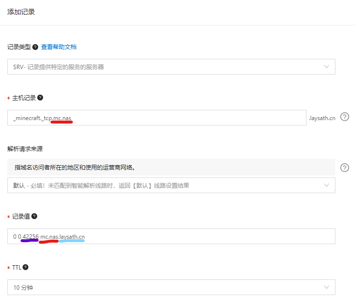

# 全锥型 NAT 的实用技巧

## 前言

如今，随着 ipv6 的普及，越来越多的家庭宽带有了 v6 公网，可仍有部分使用场景不具备 v6 条件。本文介绍了一种基于 Full Cone NAT 的内网穿透解决方案，实现近乎原生的公网 ipv6 体验。

## 准备工作

- 运营商 NAT 级别为 NAT1（Full Cone NAT，全锥型）
- 光猫打开桥接（路由器拨号）

首先得确认家庭网络是否为全锥型 NAT。测试步骤如下：

1. 确保光猫开启桥接并使用路由器拨号（如果你不理解这段话的意思，自行上 tb 搜索 “光猫桥接”）
2. 路由器中开启 DMZ 主机并指向你需要穿透的电脑的局域网 ip
3. 下载 [NatTypeTester](https://github.com/HMBSbige/NatTypeTester/releases) 进行测试，若结果都显示 Independent（即没有一个显示 Dependent），那么恭喜，你将享受 v4 公网的体验。

## STUN

STUN，全称为 Session Traversal Utilities for NAT，是一种网络协议，它允许位于 NAT（网络地址转换）后的客户端找出自己的公网地址，查找当前 NAT 设备对其进行的 NAT 类型，并在需要时保持 NAT 设备上的端口开放。

STUN 的主要作用是解决 NAT 穿透问题。NAT 穿透是指在 NAT 环境中，从公网访问 NAT 后的私网设备的问题。由于 NAT 设备的存在，私网设备对外的通信地址并非其真实的 IP 地址，这就导致了公网设备无法直接访问私网设备。STUN 通过发现设备的公网地址和 NAT 类型，帮助设备建立和公网的通信。

目前有 3 种用于 STUN 的工具，分别为

- [Lucky](https://lucky666.cn/)：拥有友好的 Web 管理页面，强烈推荐
- [Natter](https://github.com/MikeWang000000/Natter)：基于 Python 实现的命令行工具
- [NatMap](https://github.com/heiher/natmap)：基于 C++ 实现的命令行工具

本文就 Lucky 的部署进行讲解，实际上，[官方文档](https://lucky666.cn/docs/shareteach/)也给出了很多网友提供的`经验分享`，可补充阅读！

### 安装 Lucky

本文在 `Windows` 环境下部署 Lucky，其余环境可自行参考[官方文档](https://lucky666.cn/docs/install)

1. 下载[最新安装包](https://www.daji.it:6/release/)，其中分为适中版和大吉版，后者在前者的基础上增加了 `File Browser` 的功能，本文仅选择适中版即可。
2. 将安装包解压到一个固定的位置作为程序的运行环境，双击运行。
3. 检查右下角托盘区出现 lucky 的 logo，右键 “打开 Lucky 后台”，也可以顺便设置开机自启。
4. 具体使用方法请参见[官方文档](https://lucky666.cn/docs/category/基础使用说明)，如需部署 `MC服务器`、`WEB服务`等，也可直接阅读本文剩余内容。

## 案例介绍

### MC 服务器

本文以 MCSM 面板为例，其余 mc 服务器开设方式同理。

1. 启动 MC 服务器，若您尚未开服，可使用 [MCSM 面板](https://mcsmanager.com/)一键开服。
2. 确认服务器监听的端口，大多数情况下，`mc服务器`的默认端口号为 `25565`，即在客户端中输入 ip 而不指定端口时，默认就是连接 `25565`，除非特别指定端口。本文假定您的服务器开放在 25565 端口上，后续步骤请自行对照修改。
3. 进入 Lucky 添加 STUN 规则
4. 获得公网地址
5. 若始终无法获得公网地址，说明你路由器的防火墙未开放，需要设置端口转发或 DMZ 主机，参见**准备工作**第 2 条。或若你的路由器支持并打开了 UPnP 功能，可将 stun 规则里的 UPnP 开关打开，则将自动设置路由器的端口转发。
6. 至此，你已经拥有一个外网可访问的地址了。但缺点是，这个地址随时可能更换（ip 与端口号都是动态的），并非固定的。想要固定下来，可以继续阅读接下来的步骤。
7. (进阶) 首先把 ip 地址固定下来，可以使用 ddns，在 lucky 中直接设置。本文不再赘述。
8. (进阶) 本文重点讲解端口号的固定。我们使用 srv 解析。

先添加 srv 解析记录，如图

红色部分为主机名，蓝色部分为主域名，紫色部分为第 4 个步骤中得到的公网地址的端口号。红色部分与蓝色部分拼起来就是第 7 个步骤中 ip 绑定的域名。

这样设置后，mc 客户端里就只要输入域名，而不用输入端口号了，这是因为 java 版 mc 客户端会识别 srv 解析。

1. (动态更改 srv) 刚刚我们是手动设置 srv 解析记录，那就一定有办法自动设置。很遗憾，Lucky 的 ddns 中并不支持 srv 记录。我们只能自己调用域名提供商的 sdk 来实现。笔者写了个简易的 srv 更新脚本，但只支持阿里云 dns。项目开源于 https://github.com/faithleysath/python-webhook ，欢迎给个 Star。脚本也同步构建了 docker 镜像。接下来将讲解 docker 镜像的使用。
2. 首先先把镜像 pull 下来，为方便起见，windows 下推荐使用 docker desktop，搜索 `laysath/lucky-mate`，然后拉取 latest 版本的镜像，点击运行，会自动创建容器。容器需要对外暴露 8848 端口，并设置如下环境变量

其中，第一个红圈填写第 7 步中获得的 id 和 key，第二个红圈中，`SRV_RR` 填写第 8 步中的`主机记录`，`SRV_RR_VALUE` 填写你 ip 绑定的域名，`SRV_RR_ID` 请到 [sdk 调试台](https://next.api.aliyun.com/api/Alidns/2015-01-09/DescribeDomainRecords)输入你的主域名（即第 8 步的蓝色部分），发起调用得到 id，如图

1. 到 lucky 的 stun 规则中启用 Webhook，并填写如下

其中，接口地址为 `http://127.0.0.1:8848/update_srv/#{port}`，请求方法为 `GET`